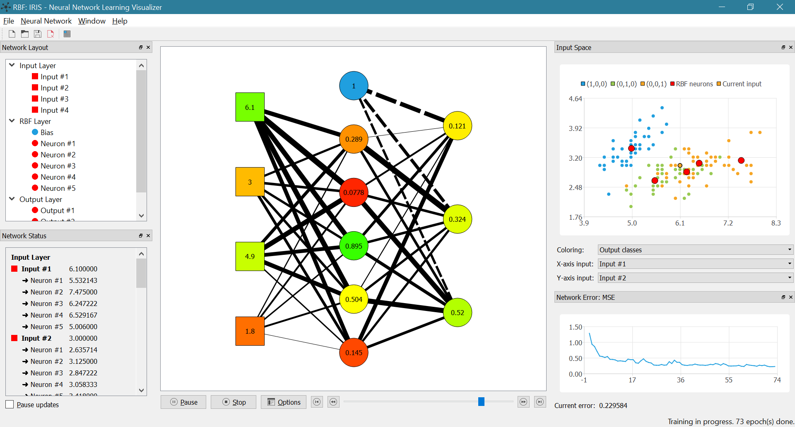

# Neural Network Learning Visualizer

Visualize the learning process of several basic classes of neural networks. This program is written in Qt5.

Currently, the following neural networks are supported:
 * Single-Layer Perceptron
 * Multi-Layer Perceptron
 * ADALINE
 * Kohonen Self-Organizing Map
 * Radial Basic Function Network
 
## Screenshot

